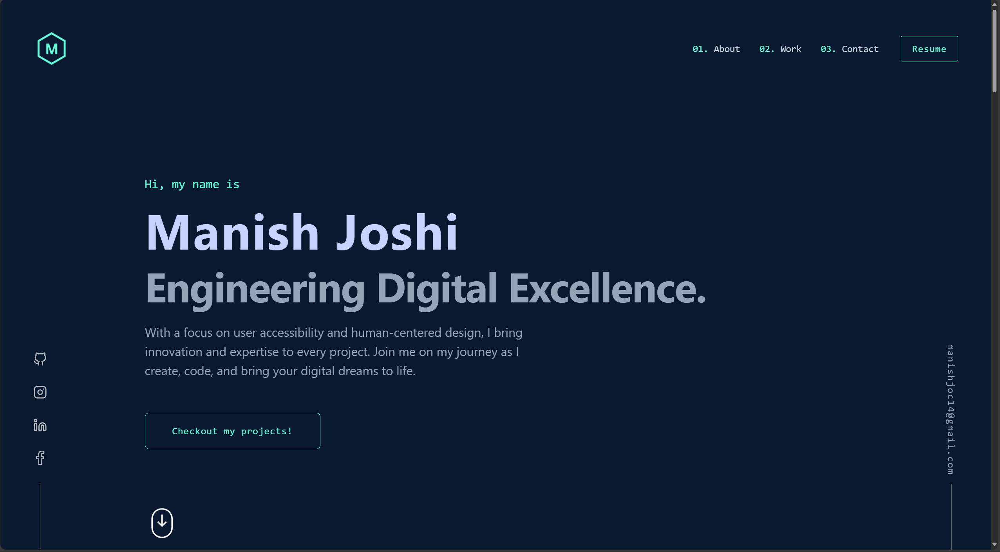

# Tailwind Portfolio

Welcome to my portfolio website! This project showcases my work and skills using modern web development technologies, including **Next.js**, **Tailwind CSS**, and **Framer Motion**.




## Table of Contents

- [Installation](#installation)
- [Technologies Used](#technologies-used)

## Installation

To run this project locally, follow these steps:

1. **Clone the repository:**

   ```bash
   git clone https://github.com/ManishJoc14/Portfolios.git
   ```

2. **Navigate to the project directory:**
      ```bash
   cd tailwind-portfolio
   ```

3. **Install dependencies:**   
   ```bash
   npm install
   ```

3. **Run the development server:**
   ```bash
   npm run dev
   ```

 4. **Open your browser:**

   - Navigate to http://localhost:3000 to see the portfolio.


## Technologies Used

- **Next.js**: A React framework that enables server-side rendering and static site generation for optimal performance.
- **Tailwind CSS**: A utility-first CSS framework that allows for rapid UI development with a consistent design.
- **Framer Motion**: A powerful library for creating smooth and interactive animations in React.
